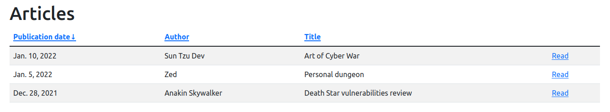

# Proof of concept for the CVE-2021-35042 vulnerability (SQL injection in Django)

The [CVE-2021-35042](https://cve.mitre.org/cgi-bin/cvename.cgi?name=CVE-2021-35042) vulnerability affects Django framework in versions 3.1.x (before 3.1.13) and 3.2.x (before 3.2.5). It allows to inject SQL code via unsanitized `QuerySet.order_by()` input. Please see the [Django security release](https://www.djangoproject.com/weblog/2021/jul/01/security-releases/) for more information.

This repository contains a proof of concept demonstrating how the vulnerability can be exploited. **The code examples are for educational purposes only!**

## vuln_sample_app

Very simple Django 3.2.4 application that displays a list of articles in a sortable table:



The application is vulnerable to the SQL injection attack (CVE-2021-35042) by design. A custom, dummy ordering have been implemented and the ordering parameter from the HTTP query string (e.g. `/articles/?order=-title`) is passed to the `Article.objects.order_by()` statement directly.

The application is configured to use 3 database servers: SQLite (default), MySQL and PostgreSQL. The current database can be set with the `DJANGO_DB` environment variable (on Linux):
* SQLite: `DJANGO_DB=sqlite` or skip the definition.
* MySQL: `DJANGO_DB=mysql`.
* PostgreSQL: `DJANGO_DB=postgresql`.

### Setup

1. Install all Python packages listed in the `requirements.txt` file. Using a virtual environment is recommended (e.g. [virtualenv](https://virtualenv.pypa.io/en/latest/)).
2. Enter your `SECRET_KEY` in the `settings.py` file.
3. Enter valid credentials (`USER` and `PASSWORD`) for MySQL and/or PostgreSQL databases configuration in the `settings.py` file.
4. In case of MySQL and PostgreSQL the database needs to be created explicitly before running the migrations: `create database vuln_sample_app;`.
5. Run the migrations on the selected database: `DJANGO_DB=<db> python manage.py migrate`.
6. Run the HTTP server (localhost:8000) for the selected database: `DJANGO_DB=<db> python manage.py runserver`.

## exploit.py

Knowing that the application is vulnerable we can use a [blind SQL injection](https://owasp.org/www-community/attacks/Blind_SQL_Injection) attack and try to extracts usernames from the `auth_user` table (created automatically by the `django.contrib.auth` application). We know that we're able to inject code to the ORDER BY clause, so we could use a query similar to this one:

```
select * from articles_article
order by 
    (articles_article.id=0),
    (case 
        when exists(select 1 from auth_user u where u.username like 'USERNAME%') 
        then author 
        else title 
    end) asc;
```

First of all, in order to exploit the vulnerability we have to use the raw SQL column name, hence the first "neutral" ORDER BY statement: `(articles_article.id=0)`. With this syntax we can perform a conditional sorting in MySQL and PostgreSQL. In this case, rows with ID = 0 will be sorted by ID ascending. Of course there are no entries with ID = 0, so this part doesn't affect the final results and the second ORDER BY statement becomes the most relevant.

If the `exists(select 1 from auth_user u where u.username like 'USERNAME%')` statement is true (1) the returned article rows are ordered by author. Otherwise, they are sorted by title. The exploit takes advantage of this and passes different combinations to the LIKE clause. Depending on how the results are ordered, it decides if a given phrase was found in the `auth_users` table.

The exploits requires a single parameter indicating which payload (for which DB server) should be used. Available options are: `sqlite`, `mysql` and `postgresql`. For example:

```
python exploit.py sqlite
```

### Remarks
* The exploit assumes the *vuln_sample_app* application is hosted locally with default settings (http://localhost:8000).
* It has been tested against the following DB servers: `SQLite 3.31.1`; `MySQL 8.0.27`; `PostgreSQL 12.9`.
* The LIKE clause is case insensitive in most cases, so the exploit doesn't recognize uppercase letters.
* Please note that this is just a simple proof of concept, tested against the application hosted on the same machine. The exploit in the current form would be blocked by any decent firewall.